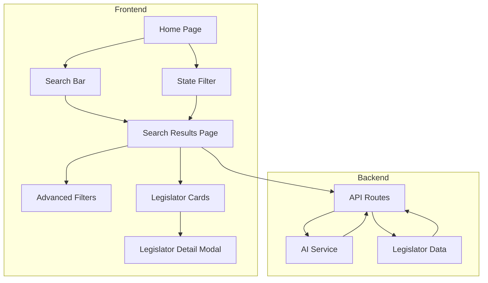

# Architecture

## System Overview



## Frontend Architecture

### App Router Structure

The application uses Next.js 15 App Router for file-based routing:

| Route     | Page    | Description                                   |
| --------- | ------- | --------------------------------------------- |
| `/`       | Home    | Landing page with search bar and state filter |
| `/search` | Results | Search results with advanced filters          |

### Component Hierarchy

```
layout.tsx
└── page.tsx (Home)
    ├── SearchBar
    └── StateFilter

└── search/page.tsx (Results)
    ├── SearchBar (persisted query)
    ├── AdvancedFilters
    │   ├── StateFilter
    │   └── TagFilters (ethnicity, party, etc.)
    └── ResultsGrid
        └── LegislatorCard[]
            └── LegislatorDetail (modal)
```

## Data Flow

### Search Flow

1. User enters search query on home page
2. User optionally selects state filter
3. Form submission navigates to `/search?q={query}&state={state}`
4. Search page reads URL params via `useSearchParams()`
5. API route called with search parameters
6. Results rendered as `LegislatorCard` components

### Filter Flow

1. Advanced filters update URL search params
2. URL change triggers data refetch
3. Results update without full page reload

## Component Breakdown

### Core Components

| Component          | Responsibility                    |
| ------------------ | --------------------------------- |
| `SearchBar`        | Text input for issue/topic search |
| `StateFilter`      | Dropdown to filter by US state    |
| `AdvancedFilters`  | Sidebar with tag-based filters    |
| `LegislatorCard`   | Display legislator summary        |
| `LegislatorDetail` | Full profile in modal/dialog      |

### UI Components (shadcn/ui)

- `Button` - Primary actions
- `Input` - Text inputs
- `Card` - Content containers
- `Select` - Dropdown selections
- `Badge` - Tags and labels
- `Dialog` - Modals
- `DropdownMenu` - Context menus

## External Integrations

### Future: AI Backend

The application is designed to integrate with an AI service for:

- Generating issue-specific blurbs about legislators
- Semantic search across voting records
- Summarizing complex policy positions

### Future: Data Sources

- Congress.gov API
- ProPublica Congress API
- OpenSecrets API
- Civic Information API

## Directory Structure Rationale

```
src/
├── app/           # Routes and layouts (Next.js convention)
├── components/    # Reusable React components
│   └── ui/        # shadcn/ui primitives
├── lib/           # Utilities and helpers
└── types/         # TypeScript type definitions
```

**Why this structure?**

- **`app/`**: Next.js 15 convention for App Router
- **`components/ui/`**: shadcn/ui convention for generated components
- **`lib/`**: Common utilities shared across components
- **`types/`**: Centralized type definitions for consistency

## State Management

The application uses URL state as the primary state management:

- Search queries stored in URL params
- Filter selections in URL params
- React state for UI-only concerns (modals, etc.)

This approach enables:

- Shareable URLs with search context
- Browser back/forward navigation
- SEO-friendly search results

## Performance Considerations

- **Turbopack**: Fast development builds
- **React Server Components**: Reduced client JS where possible
- **Motion**: Hardware-accelerated animations
- **Suspense boundaries**: Progressive loading states
